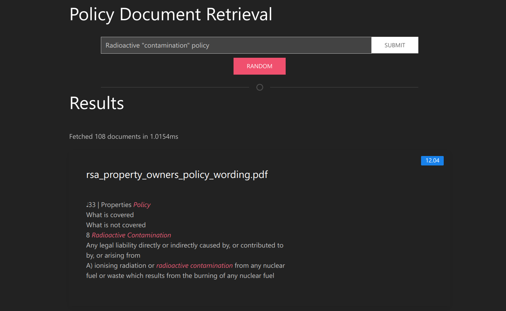

# Policy Document Retrieval System

## Usage

### Pre processing

#### Splitting into passages

Run `python3 split.py [Original_folder_path] [Target_folder_path]` to split the original text files into passages.

#### Normalising the passages

Run `python3 text.py [Split_folder_path] [Target_folder_path]` to normalise the split files into normalised passages. Each passage is stored on one line.

### Building and using the inverted index

The retrieval system runs as a server with a webpage acting as the frontend.

Run `python3 server.py` with one of the following command line argument formats to start the server:

1. `python3 server.py [Original_files_path] [Normalised_files_path]`
   where `[Original_files_path]` is the path to the folder containing files (already split) and `[Normalised_files_path]` is the path to the folder containing split files from `[Original_files_path]`
2. `python3 server.py -use-saved [pickle_file_path]`
   where `[pickle_file_path]` is the path to the pickle file saved by the program.

If the browser tab is not opened automatically, open `http://127.0.0.1:5000/index.html` to access the GUI.

To use as-is, run `python3 server.py Unnormal/ Normal2`

## Querying

You can enter your query as a normal sequence of words. Results retrieved will match atleast one of the given query terms.

You can also use the following optional qualifiers.

### `"<term>"` Include a term

Includes a specific term.

Ex. `"Earthquake" explosion fire`

### `"<phrase>"` Phrase query

Including more than one term in quotes will result in a phrase query. This will attempt to match the given phrase exactly in the given order.

Ex. `"contamination of property"`

> There should be atmost one phrase query in the search. Other phrases, if given, will be ignored.

### `-<term>` Exclude a term

Excludes a specific term.

Ex. `Unidentified Automobiles accidents -death`

